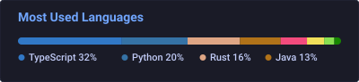
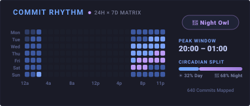
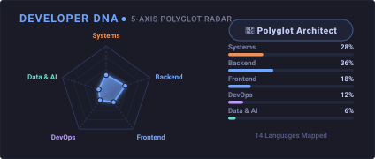

# GitStats

> Fast, lightweight, and **100% serverless** GitHub profile card suite built in native **Zig 0.16.0** and automated via GitHub Actions.

[](https://github.com/adityapandeydev/git-stats/actions)
[](https://ziglang.org/)
[](LICENSE)

GitStats delivers fully customizable, automated vector SVG cards for your GitHub profile with zero third-party service dependencies, zero rate limits, and zero downtime. Display **8 to 16+ languages** with auto-recalculated percentages, track active contribution streaks with a 14-day momentum sparkline, compute your developer craft rating, and map your 24/7 circadian commit habits.

---

## Cards & Layouts

### 1. Most Used Languages
Display top languages in multi-column grids or circular charts with language exclusion and automatic percentage recalculation.

| Standard Multi-Column (`standard`) | Donut Chart (`donut`) |
| :---: | :---: |
|  |  |

<details>
<summary><b>Compact Badge Bar Layout (Click to view)</b></summary>
<br/>



```bash
# Generate compact badge bar layout
./zig-out/bin/git_stats --generate --layout="compact" --langs-count=8 --card-height=140 --output="preview/languages/compact.svg"
```
</details>

---

### 2. Streak Card
Track continuous contribution days, longest streaks, and lifetime totals with dynamic glow tiers and an activity momentum sparkline.

| Standard (With 14-Day Sparkline) | Minimal (Without Sparkline) |
| :---: | :---: |
|  |  |

---

### 3. Developer Stats Card
A comprehensive engineering metrics card featuring a radial rating ring, percentile badge, tier grade (`S+` to `C`), and a 2×2 glass matrix for Commits, Merged PRs, Stars, and Contributed Repositories.

<div align="center">
  
</div>

---

### 4. Circadian Commit Rhythm Matrix
A 24-hour × 7-day commit punchcard heatmap (168 cells) featuring peak flow hour glow, developer persona badges (Day Architect, Night Owl, Early Bird, Weekend Warrior), a 4-hour peak flow window, and daytime vs. nighttime split tracking.

<div align="center">
  
</div>

---

### 5. Developer DNA Radar Card
A 5-axis polyglot radar chart mapping code bytes across engineering domains (Systems, Backend, Frontend, DevOps, Data & AI). Automatically calculates a developer archetype badge (Systems Architect, Backend Specialist, Frontend Craftsman, Platform Engineer, Data Engineer, or Polyglot Architect), with visual polygon fill, glowing nodes, and domain progress bars.

<div align="center">
  
</div>

---


## Quick Setup

### 1. Fork this Repository
Click **Fork** at the top right to create your own copy.

### 2. Add Your GitHub Token (For Private Repositories)
To allow the workflow to scan private repositories and grant high API rate limits:
1. Create a Personal Access Token (Classic) with `repo` scope at [github.com/settings/tokens](https://github.com/settings/tokens).
2. In your forked repository, go to **Settings** > **Secrets and variables** > **Actions**.
3. Create a repository secret named `GH_TOKEN` and paste your token.

*(If you only track public repositories, you can skip this step—the workflow will use GitHub's default token).*

### 3. Trigger the Workflow
1. Go to the **Actions** tab in your repository.
2. Select **Generate GitHub Profile Stats** and click **Run workflow**.

The workflow runs on a schedule (every 4 hours) and on workflow updates, generating your cards directly into the `generated/` directory.

### 4. Embed into Your Profile README
Add the cards to your personal profile repository (`username/username/README.md`):

```html
<div align="left">
  <!-- Right: Top Languages -->
  
  
  <!-- Left: Streak Card -->
  
  <br/>
  <!-- Left: Developer Stats Card -->
  
</div>
```
*(Replace `YOUR_USERNAME` with your GitHub username).*

---

## Repository Structure

| Directory | Description |
| :--- | :--- |
| **`generated/`** | Destination directory where the automated GitHub Actions workflow outputs your live profile SVG cards. |
| **`preview/`** | Visual showcase gallery demonstrating all card types, dimensions, and layout variations. |
| **`src/`** | Native Zig 0.16.0 engine (GraphQL API client, Linguist color mapping, SVG renderers). |
| **`.github/workflows/`** | Automated GitHub Actions workflow (`generate-stats.yml`) running on a cron schedule and workflow updates. |

---

## CLI Reference & Local Usage

The engine is built in native **Zig 0.16.0** with zero external C dependencies.

```bash
# Build release executable
zig build -Doptimize=ReleaseFast

# 1. Generate Languages Card
./zig-out/bin/git_stats --generate \
  --username="YOUR_USERNAME" \
  --langs-count=12 \
  --theme="tokyonight" \
  --layout="standard" \
  --card-width=400 \
  --card-height=364 \
  --output="generated/languages.svg"

# 2. Generate Streak Card
./zig-out/bin/git_stats --streak \
  --username="YOUR_USERNAME" \
  --theme="tokyonight" \
  --card-width=424 \
  --card-height=180 \
  --output="generated/streak.svg"

# 3. Generate Developer Stats Card
./zig-out/bin/git_stats --stats \
  --username="YOUR_USERNAME" \
  --theme="tokyonight" \
  --timeframe="all-time" \
  --output="generated/stats.svg"

# 4. Generate Circadian Commit Rhythm Card
./zig-out/bin/git_stats --rhythm \
  --username="YOUR_USERNAME" \
  --theme="tokyonight" \
  --tz=5.5 \
  --output="generated/rhythm.svg"

# 5. Generate Developer DNA Radar Card
./zig-out/bin/git_stats --radar \
  --username="YOUR_USERNAME" \
  --theme="tokyonight" \
  --output="generated/radar.svg"
```

### CLI Flags

| Flag | Default | Description |
| :--- | :---: | :--- |
| `--generate` | `false` | Generate top languages card |
| `--streak` | `false` | Generate streak statistics card |
| `--stats` | `false` | Generate developer craft & consistency rating card |
| `--rhythm` | `false` | Generate 24h × 7d circadian commit punchcard card |
| `--radar` | `false` | Generate 5-axis developer DNA polyglot radar card |
| `--username` | `adityapandeydev` | Target GitHub username |
| `--theme` | `tokyonight` | Theme preset (`tokyonight`, `github_dark`, `catppuccin`, `dracula`, `nord`, etc.) |
| `--layout` | `standard` | Card layout: `standard`, `donut`, `compact` |
| `--show-sparkline` | `true` | Toggle 14-day activity sparkline on Streak Card (`--hide-sparkline` / `--show-sparkline=false`) |
| `--timeframe` | `all-time` | Stats timeframe (`all-time` or `this-year`) |
| `--tz` | `5.5` | Timezone offset in hours (e.g. `5.5` for IST, `-5.0` for EST, `0.0` for UTC) |
| `--card-width` | `400` / `424` | Width in pixels |
| `--card-height` | `364` / `180` | Height in pixels |
| `--border-radius` | `4.5` | Corner radius in pixels |
| `--output`, `-o` | `languages.svg` | Output file path (e.g. `generated/streak.svg`) |
| `--hide` | `""` | Comma-separated languages to hide (e.g. `html,css,jupyter notebook`) |
| `--exclude-repo` | `""` | Comma-separated repositories to exclude |

---

## Built-in Themes

| Theme Name | Description |
| :--- | :--- |
| `tokyonight` | Modern dark navy developer palette (`#1a1b27`) |
| `github_dark` | GitHub's native dark mode (`#0d1117`) |
| `catppuccin` | Catppuccin Mocha cozy pastel dark palette (`#1e1e2e`) |
| `dracula` | Classic Dracula vampire theme (`#282a36`) |
| `nord` | Arctic north-bluish palette (`#2e3440`) |
| `synthwave` | Vibrant 80s neon magenta & cyan (`#2b213a`) |
| `onedark` | Atom One Dark theme (`#282c34`) |
| `radical` | High-contrast retro theme (`#141321`) |
| `midnight` | Deep OLED black (`#050508`) with electric indigo |
| `github_light` | Clean GitHub light mode theme (`#ffffff`) |

---

## License

This project is licensed under the MIT License - see the [LICENSE](LICENSE) file for details.
